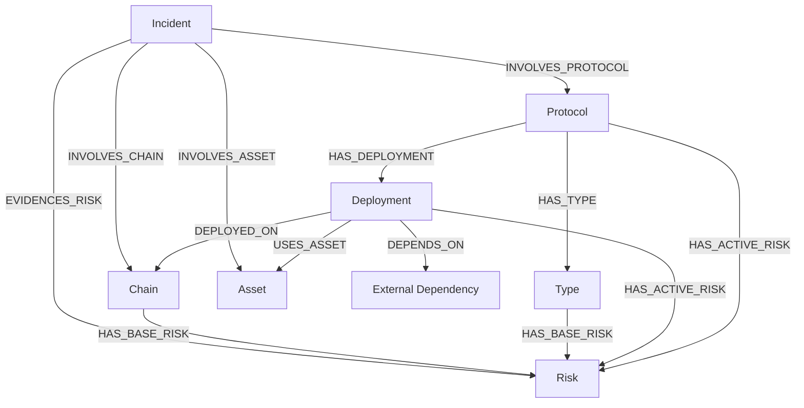

# CoinYield Risk Model

### https://www.coinyield.org/risk-graph

`coinyield-risk-model` is the source-of-truth repository for CoinYield's curated DeFi
risk model.

It contains:

- protocol risk profiles
- chain risk profiles
- taxonomy risk IDs
- incident / hack evidence
- attack-pattern mappings
- Neo4j import and validation tooling

This repository is a data/model repository, not an application repository.

## Repository Structure

Core source-of-truth content lives under:

- `risk_model/protocols/`
- `risk_model/chains/`
- `risk_model/types/`
- `risk_model/taxonomy/`
- `risk_model/incidents/`
- `risk_model/attack_patterns/`

Supporting tooling lives under:

- `risk_model/neo4j/`
- `risk_model/incidents/bootstrap_*.py`
- `Makefile`
- `docker-compose.yml`
- `.github/workflows/`

Local-only working inputs that are not meant for the public repository are kept
outside the public surface and gitignored, including:

- `internal/`
- `audits/`
- `dex_pools/`
- `postmortems/`

## How The Model Works

The repo is **graph-first**.

Markdown and YAML files are the human-editable source of truth. They are then
compiled into a Neo4j graph so the model can answer dependency and cascade
questions across layers.



You can think about the model in two layers:

1. **Source-of-truth layer**  
   Contributors edit protocol, chain, taxonomy, and incident files.
2. **Query layer**  
   Neo4j turns those files into a graph so you can ask questions like:
   - which deployments depend on a given protocol or asset
   - which risks are active on a chain vs a protocol vs an asset
   - which incidents support a given `risk_id`
   - what the likely downstream blast radius is if an upstream dependency fails

This is what lets the model answer questions like:

- "If `rsETH` is impaired, which Aave deployments are exposed?"
- "Which incidents support `bad_debt_socialization`?"
- "What depends on Kelp on Ethereum vs on Arbitrum?"

## Local Workflow

From repo root:

```bash
make risk-graph-build
make neo4j-up
make neo4j-import
make neo4j-ci-check
```

For broader diagnostics:

```bash
make neo4j-check
```

Neo4j setup details live in [risk_model/neo4j/README.md](risk_model/neo4j/README.md).

## Contributing

See [CONTRIBUTING.md](CONTRIBUTING.md).

In short:

- edit Markdown/YAML source-of-truth files
- regenerate `risk_model/neo4j/generated/risk_model.cypher`
- run local checks
- open one semantic PR at a time

## Licensing

See:

- [LICENSE](LICENSE)
- [LICENSES.md](LICENSES.md)
